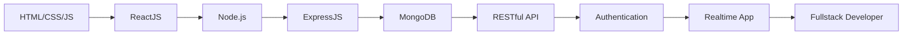

<div align="center">
  

  

  <p>
    <strong>An Duc Anh</strong> |
    <strong>Fullstack Developer Intern</strong> |
    Information Technology Student
  </p>

  <p>
    <a href="https://ducanhdev.io.vn" target="_blank">Live Portfolio</a> •
    <a href="https://github.com/AnAnh2k">GitHub</a> •
    <a href="mailto:anducanh125@gmail.com">Email</a>
  </p>
</div>

<div align="center">
  
  
  
  
</div>

<br />

<div align="center">
  
</div>

---

## 🚀 About Me

```ts
const anDucAnh = {
  role: "Fullstack Developer Intern",
  location: "Ha Noi, Viet Nam",
  education: "Information Technology - Hanoi Open University",
  focus: ["ReactJS", "Node.js", "ExpressJS", "RESTful API", "MongoDB"],
  currentlyLearning: ["Backend Development", "System Design Basics", "Clean Code"],
  goal: "Become a Fullstack Developer who can build real-world web products",
};
````

* 🎓 Information Technology student at Hanoi Open University
* 💻 Interested in Fullstack Web Development with ReactJS and Node.js
* ⚙️ Comfortable building RESTful APIs, CRUD systems, authentication flows, and responsive user interfaces
* 🔐 Learning more about JWT authentication, database design, and backend architecture
* 🚀 Looking for an internship opportunity to gain real-world experience and improve teamwork skills

> I enjoy turning ideas into usable web products with clean UI, clear logic, and reliable backend flow.

---

## ✨ What I Can Do

<table>
  <tr>
    <td width="50%">
      <h3>🎨 Frontend</h3>
      <ul>
        <li>Build responsive user interfaces</li>
        <li>Work with ReactJS and TypeScript</li>
        <li>Handle forms, state, routing, and API integration</li>
        <li>Use Tailwind CSS, Bootstrap, Ant Design, and Shadcn UI</li>
      </ul>
    </td>
    <td width="50%">
      <h3>⚙️ Backend</h3>
      <ul>
        <li>Build RESTful APIs with Node.js and ExpressJS</li>
        <li>Design CRUD flows and connect with databases</li>
        <li>Work with JWT authentication and middleware</li>
        <li>Use MongoDB, MySQL, PostgreSQL, and Prisma ORM</li>
      </ul>
    </td>
  </tr>
</table>

---

## 🛠 Tech Stack

| Area     | Technologies                                                      |
| -------- | ----------------------------------------------------------------- |
| Frontend | HTML, CSS, JavaScript, TypeScript, ReactJS, Next.js               |
| Styling  | Tailwind CSS, Bootstrap, Ant Design, Shadcn UI, Responsive Design |
| Backend  | Node.js, ExpressJS, RESTful API, JWT Authentication               |
| Database | MongoDB, MySQL, PostgreSQL, SQL Server, Prisma ORM                |
| Tools    | Git, GitHub, Postman, Vercel, Render, Supabase                    |
| Others   | MVC Pattern, OOP, API Integration, CRUD System                    |

---

## 📌 Featured Projects

### 1) QQNA Chat - Realtime Chat Application

A fullstack realtime chat and Q&A platform built with ReactJS, Node.js, Express, MongoDB, and Socket.io.

* 🔹 Authentication with JWT and bcrypt
* 🔹 One-to-one messaging and group chat
* 🔹 Friend management
* 🔹 Online/offline status
* 🔹 Message seen tracking
* 🔹 Emoji support
* 🔹 Avatar upload with Cloudinary
* 🔹 RESTful API integration
* 🔹 Frontend deployed on Vercel and backend deployed on Render

**Tech Stack:** React, TypeScript, Node.js, ExpressJS, MongoDB, Socket.io, JWT, bcrypt, Cloudinary

🔗 Demo: https://chat.qqnachat.io.vn/
🔗 Source: https://github.com/AnAnh2k/qqna-chat

---

### 2) Todo-A - Fullstack Todo Application

A fullstack task management application focused on CRUD operations and frontend-backend integration.

* 🔹 Create, read, update, and delete tasks
* 🔹 Task status management
* 🔹 Responsive user interface
* 🔹 RESTful API integration
* 🔹 MongoDB database integration
* 🔹 Frontend deployed on Vercel and backend deployed on Render

**Tech Stack:** React, Node.js, ExpressJS, MongoDB, RESTful API

🔗 Demo: https://todoa-theta.vercel.app
🔗 Source: https://github.com/AnAnh2k/Todo-A

---

### 3) Bao Dai Medical Station Portal

A real-world information portal and admin dashboard for a local medical station.

* 🔹 Document management
* 🔹 Health news management
* 🔹 Admin dashboard
* 🔹 Responsive interface
* 🔹 Database integration with Prisma ORM and PostgreSQL

**Tech Stack:** Next.js, TypeScript, Tailwind CSS, Prisma ORM, PostgreSQL

🔗 Demo: https://ttytbaodai.vercel.app
🔗 Source: https://github.com/AnAnh2k/ttytbaodai

---

## 🔥 Learning Roadmap



---

## 📊 GitHub Stats

<div align="center">
  


</div>

<div align="center">
  
</div>

---

## 🌈 Activity Graph

<div align="center">
  
</div>

---

## 🧩 Current Focus

<div align="center">
  
  
  
  
</div>

---

## 📫 Contact Me

<div align="center">
  <a href="mailto:anducanh125@gmail.com">
    
  </a>
  <a href="https://github.com/AnAnh2k">
    
  </a>
  <a href="https://ducanhportfolio.netlify.app">
    
  </a>
</div>

---

<div align="center">
  
</div>
```
